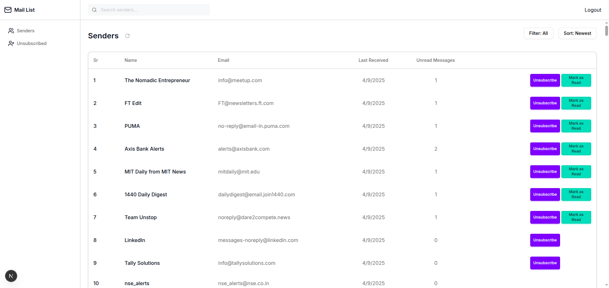

# 📬 Mail List

Manage your email senders like a pro.  
**Mail List** lets you organize, filter, and unsubscribe from unwanted senders—clean, fast, and all in one place.



---

## 🚀 Features

- 🔐 **Google Authentication** (via Supabase)
- 📥 **Fetch Senders** using Gmail API (OAuth2)
- 📂 **Organized Senders List** with:
  - Unread Count
  - Last Received Date
  - Filter by: All, Unread, Unsubscribe
  - Sort by: Name, Date, Unread Count
- 📤 **Unsubscribe from Newsletters**
  - Opens the original unsubscribe link
  - Moves the sender to a "Unsubscribed" list
- ✅ **Mark All as Read** for any sender
- 🔁 **Manual & Auto Refresh**
- 🔍 **Search Senders**
- 📄 **Privacy Policy** & **Terms of Use**
- 🔐 **Row Level Security** (Supabase RLS)
- ☁️ **Production Ready (Deployed on Vercel)**

---

## 🛠️ Tech Stack

- **Frontend:** Next.js 14 (App Router), Tailwind CSS, Shadcn/ui
- **Backend:** Supabase (DB + Auth + RLS), Gmail API
- **Deployment:** Vercel

---

## 🔧 Local Setup

1. **Clone the Repo**

```bash
git clone https://github.com/yourusername/mail-list.git
cd mail-list
